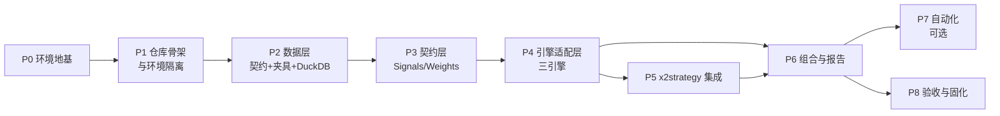

# 本地量化研究平台 · 部署执行手册

日期：2026-09-29
状态：**待执行**。本文档只描述部署步骤与验证措施，不代表任何步骤已经执行成功。
读者：后续执行部署的 AI agent（或人工工程师）。执行时**逐步照做、逐步留证**，不得跳步。

---

## 0. 本手册怎么用（执行规约）

### 0.1 硬性规则

1. **不得跳步**。每个 Phase 末尾有 Gate，Gate 未通过不得进入下一 Phase。
2. **不得为了通过验证而降低标准**。若某步验证失败，停下来记录，按"失败处理"处置；不许注释掉断言、放宽容差、伪造证据。
3. **每步幂等**。所有步骤可重复执行；重复执行不应产生副作用或损坏已有数据。
4. **每步留证**。执行后把"命令 + 实际输出 + 判定"追加到 `docs/deploy/EVIDENCE.md`。无证据的步骤视为未完成。
5. **供应商无关**。所有数据供应商、LLM provider 暂留空（`[VENDOR-TBD]`）。**关键路径上的验证一律使用本地合成夹具数据**，不得依赖任何外部供应商即可全绿。
6. **不确定就停**。遇到本手册未覆盖的选择（例如环境需要再切分），先记录现象与候选方案，停下等人工确认，不要自行发明架构。

### 0.2 每步的字段含义

| 字段 | 含义 |
| --- | --- |
| 目的 | 这一步为什么存在 |
| 前置 | 必须先完成哪些步骤 |
| 执行 | 具体命令或动作 |
| 产出 | 应该产生哪些文件/状态 |
| 验证 | **必须逐条回执的检查项**（含可直接运行的手段） |
| 失败处理 | 常见失败的处置方向 |
| 完成定义 | 判定"这步做完了"的标准 |

### 0.3 验证强度分级

本手册用 V0–V4 标注每步验证的强度，Gate 只认对应级别以上的证据。

| 级别 | 含义 | 例 |
| --- | --- | --- |
| V0 | 存在性 | 文件存在、命令在 PATH 中 |
| V1 | 可执行 | 命令退出码 0，无异常 |
| V2 | 功能性 | 端到端小样本跑通并产出预期结构 |
| V3 | 语义/负向 | 扰动测试、边界用例、口径正确性 |
| V4 | 可复现 | 相同输入 + 相同锁文件 → 结果在容差内一致 |

### 0.4 全局变量（执行时按本机实际填写）

| 变量 | 本机取值 | 说明 |
| --- | --- | --- |
| `PROJECT_ROOT` | `D:\project\quant` | 项目根 |
| `PY_CORE` | 待 P1 解析确定（起点 3.12） | 主环境 Python |
| `PY_VBT` | 待 P1 解析确定 | vectorbt 环境 Python |
| `PY_X2` | 待 P1 解析确定 | x2strategy 环境 Python |

> **Python 版本原则（适用全部环境）**：**不预先统一版本，由各环境实际的组件依赖解析结果决定，可用性优先。** 起点用 3.12，解析不通过就独立下调该环境的版本，**不得**为了"版本统一"而牺牲某个组件装不上。决策规则见 P1.3。
| `DATA_ROOT` | `D:\project\quant\data` | 数据落盘根 |
| `DUCKDB_PATH` | `D:\project\quant\data\warehouse.duckdb` | DuckDB 仓库文件 |

> 本手册命令一律为 **PowerShell** 语法。环境变量引用用 `$env:NAME`，不要用 cmd 的 `%NAME%`。

---

## 1. 范围与业务口径

> **本手册是唯一权威的执行文档。** 项目的业务口径（研究假设、跨市场成交规则、默认验收策略、最小验收清单、免费数据检查表）已合并进 **附录 F**。原《本地 ETF 量化研究环境：系统架构与部署步骤》文档**已删除**，不再维护。

### 1.1 系统范围

> **x2strategy + bt + backtrader + vectorbt 四引擎并存；DuckDB 作为本地历史数据（行情、宏观等）仓库。**

关于 `docs/archive/OPEN_SOURCE_COMPARISON.md`：它是**归档文献**，记录选型时的许可证与版本证据。**执行部署时不需要阅读**；仅当需要复核"某个许可证是什么""某版本号是哪来的"时再查阅。本手册已把执行所需的结论内联，不依赖该文件。

### 1.2 采用本范围带来的三处约束（**执行前需知悉**）

| # | 事实 | 影响 | 本手册的处理 |
| --- | --- | --- | --- |
| D1 | vectorbt 许可证为 **Apache-2.0 + Commons Clause**（含限制出售软件及部分相关服务的附加条件，**非标准开源**） | 常驻使用需隔离 | 强制**独立环境**，仅个人研究，不进入分发物 |
| D2 | backtrader 最近 PyPI 发布为 2023-04，许可证 **GPL-3.0+** | 可能与新版 pandas 不兼容 | 放入 core 或独立环境，先验证兼容性（见 P1） |
| D3 | DuckDB 为单写多读 | 并发写会损坏 | 采用 **Parquet 为真相 + DuckDB 为查询层**（见 §3.2） |

### 1.3 继续保持的纪律

以下既有约束在本手册中**原样继承，不打折**：

- 原始快照不可原地覆盖；修正后保存新快照；写入用临时文件再替换。
- 交易日期 ≠ 数据可用时间；必须显式记录可用时间与保守滞后假设。
- 免费历史回填数据**不得**称为严格 point-in-time 数据。
- 收益必须区分**价格收益 / 总收益**、**本币 / 基准货币**；复权方式必须标记来源。
- 汇率内部统一为「1 单位原币 = 多少**基准货币**」，方向不符时取倒数并留记录。
  > **基准货币支持多基准并存，默认 CNY**（2026-09-29 决策）。含义：基准货币是运行期配置项，不是平台常量；同一次研究可分别以 CNY / USD / HKD 等产出报告，**各自独立、不得互相覆盖**。落地要求：`fx_rates` 需支持任意 `(base, quote)` 对；`runs` 表与报告须记录所用基准货币；跨基准对比时显式标注换算口径。原 ETF 设计把它固定为人民币，那是"中港美 ETF 人民币研究账户"的场景假设，本架构不得写死。
- 跨市场异步成交：不能用"同日收盘"假设三地同时换仓；未成交卖单不得预先释放资金。
- 休市、停牌、下载失败必须**分别标记**，不得静默填零。

### 1.4 明确不在本次范围

- 券商连接、自动下单、实盘。
- 定时任务/调度：P7 为可选项。**是否启用取决于"数据是否需要自动更新"**（本架构的编排层本就预留了 Task Scheduler / Prefect）。默认不启用，启用需人工确认。
- 多币种真实现金账本、结算周期、真实手数（属精细执行层，未来评估 LEAN / NautilusTrader）。

---

## 2. 部署顺序的依据

顺序不是任选的，而是由依赖关系决定。上层依赖下层，下层不稳定则上层的验证结论无意义。



**排序理由**

| 顺序 | 理由 |
| --- | --- |
| P0 → P1 | 环境解析结果决定后面所有脚本怎么调用；不确定环境边界就开始写代码会反复返工 |
| P1 → P2 | 数据层要在某个确定的 Python 环境里跑 |
| P2 → P3 | 契约层的测试需要数据；且契约的"可用时间/掩码"语义直接来自数据层 |
| P3 → P4 | 引擎只消费契约，契约不定死，三个引擎的适配无法收敛 |
| P4 → P5 | x2strategy 产出的规格要能立刻喂给引擎验证，否则无法判断规格对错 |
| P4 → P6 | 组合层消费各引擎的单策略净值 |
| P6 → P7/P8 | 只有全链路通了，自动化与固化才有对象 |

> **关键顺序决策**：**先做数据层的合成夹具（P2.2），再做引擎适配（P4）**。因为数据供应商留空，若无夹具，P4 的三引擎对拍将无从验证。

---

## 3. 全局约定

### 3.1 环境隔离（本手册的核心结构决策）

**结论：每个引擎一个独立 uv 项目，不使用 uv workspace。**

理由：uv workspace 会解析出**单一** `uv.lock`，等于共享依赖解，无法隔离。而已知存在真实冲突：

| 包 | 依赖区间 | 来源 |
| --- | --- | --- |
| vectorbt 1.1.1 | `pandas>=3.0.3,<4.0`、`numpy>=2.4.6`、`numba>=0.66` | 归档文献 §8.1（PyPI 元数据，2026-09-26 核对） |
| Alphalens-reloaded 0.4.6 | `pandas>=1.5.0,<3.0` | 同上（本项目暂不安装，作为冲突存在性的证据） |

**目标环境布局**（P1 解析后可能调整，调整规则见 P1.3）：

| 环境 | 目录 | 目标内容 | Python 版本 |
| --- | --- | --- | --- |
| core | 根目录 | pandas / pyarrow / duckdb / matplotlib / jupyterlab / exchange-calendars / tzdata / **bt** / ffn / **backtrader** | 起点 3.12，按解析结果定 |
| vbt | `envs/vbt` | **vectorbt** | 起点 3.12，按 vectorbt 依赖定 |
| x2 | `envs/x2` | **x2strategy** + litellm | 按 x2strategy 元数据定 |
| （回退）btrader | `envs/btrader` | 仅当 backtrader 与 core 冲突时创建 | 按冲突分量定 |

与对话中给出的示意版本（core 3.11 / vbt·bt 3.10）的关系：**不作硬性规定**。可用性优先，各环境版本由 P1.3 的解析流程独立确定；已知 vectorbt 一侧要求 `pandas>=3.0.3` + `numpy>=2.4.6`，会牵制其 Python 下限，但最终以本机解析结果为准。

**跨环境通信规则（强制）**：环境之间**不得互相 import**。一切交换通过**文件**：

```
调用方(core) → 写 job.json + 输入 Parquet → subprocess 调目标环境的 entry.py
目标环境     → 读 job.json → 执行 → 写 result.parquet + result.json → 退出
调用方(core) → 读 result.* → 继续
```

### 3.2 数据存储约定

- **Parquet 是真相，DuckDB 是查询层**。原始与标准化数据一律以 Parquet 落盘；DuckDB 通过视图暴露，不承载唯一副本。
- **原始快照不可变**：`data/bronze/<source>/<dataset>/<snapshot_id>/*.parquet`，只增不改。
- **DuckDB 单写多读**：唯一写入方是 ingest 进程；研究/回测进程一律 `read_only=True`。
- 大表（分钟级、tick）不进 `.duckdb` 文件，用 `read_parquet(...)` 视图。
- 每次 ingest 记录 `snapshot_id + 行数 + 哈希 + watermark` 到清单，纳入版本控制。

### 3.3 目录约定

```text
D:\project\quant\
  pyproject.toml / uv.lock / .python-version     # core 环境
  docs\archive\OPEN_SOURCE_COMPARISON.md         # 归档文献：执行时不需要读
  LOCAL_DEPLOYMENT_PLAN.md                       # 本文档
  envs\
    vbt\  { pyproject.toml, uv.lock, probe.py, entry.py }
    x2\   { pyproject.toml, uv.lock, probe.py, entry.py }
  config\
    settings.toml        # 路径、内存、线程、日志
    sources.toml         # 供应商配置（声明式；接线见附录 A）
    engines.yaml         # 各引擎默认参数
  src\quantlab\
    fixtures\            # 合成夹具生成与校验
    store\               # duckdb 连接、schema、水位、快照
    ingest\              # Source 协议 + 适配器（本次仅骨架）
    contract\            # StrategySpec / Signals / TargetWeights / lint / emit
    engines\             # 三个 Runner + 跨进程桥
    portfolio\  eval\  registry\
    cli.py
  docs\deploy\EVIDENCE.md
  data\  { bronze\, silver\, gold\, warehouse.duckdb }
  runs\
  tests\
```

---

## 4. 部署阶段

---

## P0 · 环境地基

**目标**：确认本机满足前提条件，建立可写、可快速 IO 的工作面。
**前置**：无。

### P0.1 系统与工具核查

- **目的**：确认 Windows 版本、已有工具、磁盘余量、长路径设置。
- **执行**（PowerShell）：

```powershell
[System.Environment]::OSVersion.Version          # 期望 Windows 11 (10.0.22000+)
git --version
uv --version
Get-PSDrive D | Select-Object Used,Free          # 期望剩余 >= 50 GB
Get-ItemProperty 'HKLM:\SYSTEM\CurrentControlSet\Control\FileSystem' -Name LongPathsEnabled
```

- **产出**：`docs/deploy/EVIDENCE.md` 中的核查记录。
- **验证**：
  - [ ] **V0** `git`、`uv` 均可执行并打印版本
  - [ ] **V0** `LongPathsEnabled = 1`；若为 0 或不存在，以管理员执行：
    `Set-ItemProperty 'HKLM:\SYSTEM\CurrentControlSet\Control\FileSystem' -Name LongPathsEnabled -Value 1`，重启后复检
  - [ ] **V0** D 盘剩余空间 ≥ 50 GB
- **失败处理**：`uv` 缺失 → 从官方渠道安装（<https://docs.astral.sh/uv/>），不使用不明来源脚本。
  - 长路径改动需重启才生效。**无管理员权限时可人工显式豁免**，在 `EVIDENCE.md` 记 `GateP0.long_paths=WAIVED` 并注明取舍理由 —— **豁免不等于通过**，不得解读为该检查已通过。
- **完成定义**：三项检查全部留证通过。

### P0.2 目录与 IO 优化

- **目的**：建立目录骨架；把数据目录排除出 Defender 实时扫描以提升回测/扫描 IO。
- **执行**（排除项需管理员权限）：

```powershell
Set-Location 'D:\project\quant'
New-Item -ItemType Directory -Force -Path data\bronze, data\silver, data\gold, docs\deploy, src\quantlab, tests, runs, config | Out-Null
if (-not (Test-Path docs\deploy\EVIDENCE.md)) { New-Item -ItemType File -Path docs\deploy\EVIDENCE.md | Out-Null }   # P0.1 起就要往里写证据
Add-MpPreference -ExclusionPath 'D:\project\quant\data'
(Get-MpPreference).ExclusionPath
```

- **产出**：目录存在；Defender 排除项已登记。
- **验证**：
  - [ ] **V0** 上述目录全部存在
  - [ ] **V0** `docs\deploy\EVIDENCE.md` 已创建
  - [ ] **V0** `(Get-MpPreference).ExclusionPath` 输出包含 `D:\project\quant\data`
  - [ ] **V0** 未关闭 Defender 的**任何防护功能**，仅添加了路径排除
- **失败处理**：无管理员权限 → 记录并跳过排除（不阻塞），在 `EVIDENCE.md` 标注 `ExclusionPath=SKIPPED(no admin)`。
- **完成定义**：目录建立完成；排除项已登记或已标注跳过。

### P0.3 供应商与凭据占位

- **目的**：先把"配置从哪来"定好，避免后续把密钥写进代码。
- **执行**：

1. 创建 `config/sources.toml`，内容为**声明式模板**（结构见附录 A；凭据只写环境变量名）。
2. 约定所有凭据通过**环境变量**读取，不落盘到仓库。
3. 创建 `.gitignore`，至少包含：

```gitignore
.venv/
envs/*/.venv/
__pycache__/
*.pyc
data/
runs/
.ipynb_checkpoints/
.env
*.key
```

- **产出**：`config/sources.toml`（声明式模板，无明文密钥）、`.gitignore`。
- **验证**：
  - [ ] **V0** `sources.toml` 中不存在任何真实 key，仅占位符
  - [ ] **V0** `.gitignore` 覆盖 `.venv/`、`data/`、`runs/`、`.env`
  - [ ] **V1** `git check-ignore -v .env` 有命中（初始化 git 后执行）
- **失败处理**：无。
- **完成定义**：占位配置与忽略规则就位。

### 🚦 Gate P0

| 检查 | 通过条件 |
| --- | --- |
| 工具 | git / uv 可用 |
| 长路径 | `LongPathsEnabled=1` |
| 空间 | D 盘剩余 ≥ 50 GB |
| 目录 | 骨架目录全部存在 |
| 凭据 | 仓库内无明文密钥；`.gitignore` 生效 |
| 证据 | 以上均已写入 `docs/deploy/EVIDENCE.md` |

**全部满足才能进入 P1。**

---

## P1 · 仓库骨架与环境隔离

**目标**：建立 git 仓库，解析并锁定各环境依赖，确定最终环境边界。
**前置**：Gate P0 通过。

> **本阶段是全流程返工风险最高的一步**。环境边界一旦定错，P2 之后都要重来。因此 P1 的 Gate 要求每个环境都有可执行探针。

### P1.1 初始化仓库

- **执行**：

```powershell
Set-Location 'D:\project\quant'
git init
git add -A
git commit -m "chore: initial docs and skeleton"
```

- **验证**：
  - [ ] **V1** `git status` 干净或无意外文件
  - [ ] **V0** `git check-ignore -v data/` 命中
- **完成定义**：仓库建立，忽略规则生效。

### P1.2 建立 core 环境

- **目的**：主环境，承载 bt、backtrader、DuckDB、数据与研究代码。
- **执行**：

```powershell
Set-Location 'D:\project\quant'
uv init --bare --python 3.12          # 3.12 仅为起点，按解析结果可下调
uv python pin 3.12
uv add numpy pandas pyarrow matplotlib jupyterlab ipykernel exchange-calendars tzdata duckdb bt
uv sync --locked
```

> 若 `uv add` 因 Python 版本不满足而失败，**不要**手工放宽依赖版本去迁就 3.12；改为下调该环境的 Python（见 P1.3 规则）后重试。

先**暂不**安装 backtrader。随后单独尝试：

```powershell
uv add backtrader
```

- **产出**：根 `pyproject.toml`、`uv.lock`、`.python-version`、`.venv`。
- **验证**：
  - [ ] **V1** `uv run python --version` 输出 `PY_CORE` 记录的版本（起点 3.12；若已按 P1.3 下调则以 `EVIDENCE.md` 为准，**不要**把 3.12 写死成通过条件），且 `uv run python -c "import sys;print(sys.executable)"` 指向 `D:\project\quant\.venv`
  - [ ] **V1** `uv run python -c "import numpy,pandas,pyarrow,duckdb,bt,exchange_calendars;print('core imports OK')"`
  - [ ] **V1** `uv run python -c "import duckdb;print(duckdb.__version__)"`（期望与既有报告观察值 1.5.5 同主版本；实际以解析结果为准）
  - [ ] **V3** `uv run python -c "import exchange_calendars as xc;print([xc.get_calendar(n).name for n in ('XSHG','XHKG','XNYS')])"` 三个日历均实例化成功
  - [ ] **V3** 检查日历库的**可用历史范围**覆盖十年样本（默认日历范围可能不足）
- **失败处理**：
  - 依赖求解冲突 → **不要**用 `--no-deps`、不要手工 `pip install --force`。改为按 §1.1 D2 拆出 `envs/btrader`（见 P1.3 决策规则）。
  - 网络超时 / 限流 / 依赖不兼容是**三类不同问题**，分别诊断，不关闭 TLS 校验绕过。
- **完成定义**：core 环境可导入全部核心包，三个日历可用且范围足够。

### P1.3 建立 vbt 与 x2 环境，确定环境边界

- **目的**：隔离 vectorbt（许可 + 依赖）与 x2strategy（LLM 依赖）。
- **执行**：

```powershell
# vectorbt 环境
uv init --bare --python 3.12 envs/vbt
uv add --project envs/vbt vectorbt

# x2strategy 环境（包名与安装方式以仓库说明为准，见下）
uv init --bare --python 3.12 envs/x2
uv add --project envs/x2 litellm
uv add --project envs/x2 "x2strategy @ git+https://github.com/ALAGENT-HKU/x2strategy"
```

- **Python 版本决策规则**（可用性优先，**必须按此执行并留证**）：

| 情形 | 决策 |
| --- | --- |
| 起点 3.12 解析通过 | 该环境即用 3.12 |
| 解析失败且原因是 **Python 版本不满足**（如某包 `requires-python` 更高或更低） | 查该包元数据的 `requires-python`，取满足**全部**组件的最高版本；**只调该环境**，不影响其他环境 |
| 解析失败且原因是 **组件互相冲突**（如 pandas 主版本） | 按上表拆环境，而不是调 Python 版本 |
| 需要为迁就 A 而降低 B 的版本 | **禁止**。要么拆环境，要么换 A 的替代实现 |

- **版本差异是允许的**：三个环境用不同 Python 版本**不算问题**，也**不要**为了"整齐"去对齐。只有"同一环境内装不上"才是问题。最终版本以 `uv.lock` 为准，记入 `EVIDENCE.md`。

- **环境边界决策规则**（**必须按此执行并留证**）：

| 情形 | 决策 |
| --- | --- |
| backtrader 与 core 可共存 | 保留在 core，不创建 `envs/btrader` |
| backtrader 与 core 冲突（如 pandas 主版本） | 创建 `envs/btrader`，backtrader 迁入 |
| x2strategy 与 litellm/其他依赖冲突 | 允许 x2 环境内再锁定；**不得**为迁就它改动 core 的 pandas 主版本 |
| vectorbt 与任何其他组件同环境 | **禁止**。必须独立 |

- **产出**：`envs/vbt/`、`envs/x2/` 各自的 `pyproject.toml` + `uv.lock`；以及一份记录在 `EVIDENCE.md` 的**环境边界表**。
- **验证**：
  - [ ] **V0** **每个环境有各自独立的 `uv.lock`**（`Get-ChildItem -Recurse -Filter uv.lock` 应看到 3 份，回退情形 4 份）
  - [ ] **V0** 根 `pyproject.toml` 中**不存在** `[tool.uv.workspace]` 段
  - [ ] **V1** `uv run --project envs/vbt python -c "import vectorbt as vbt;print(vbt.__version__)"`
  - [ ] **V2** `uv run --project envs/vbt python -c "import vectorbt as vbt,pandas as pd,numpy as np;c=np.cumsum(np.random.RandomState(0).randn(200));pf=vbt.Portfolio.from_holding(pd.Series(c),init_cash=1e5);print(pf.total_return())"` 能算出结果（证明 numba JIT 链可用）
  - [ ] **V1** `uv run --project envs/x2 python -c "import x2strategy;print('x2 OK')"`（模块名以实际包为准）
  - [ ] **V0** 记录**每个环境最终采用的 Python 版本**到 `EVIDENCE.md`，并写明"为什么是这个版本"（解析通过 / 因某包 `requires-python` 下调）
  - [ ] **V3** 确认**没有任何环境**是通过放宽某组件版本约束才装上的（逐环境核对 `uv.lock` 中的版本是否即为该组件当前可用版本）
- **失败处理**：
  - numba 首次调用慢属正常，勿误判为卡死；给足超时。
  - x2strategy 若无 PyPI 包名或需额外系统依赖，记录实际安装方式，**不要**猜测包名硬装。
- **完成定义**：环境边界表确定并留证；每个环境可导入其核心包。

### P1.4 环境探针

- **目的**：让"环境是否可用"变成一条可重复执行的命令，成为后续所有步骤的前置检查。
- **执行**：为每个环境创建 `probe.py`（core 放 `src/quantlab/probe.py`，其余放各自目录），输出 JSON：

```python
# 探针输出结构（示意）
{
  "env": "core",
  "python": "3.12.x",
  "executable": "<绝对路径>",
  "packages": {"pandas": "...", "numpy": "...", "duckdb": "...", "bt": "...", "backtrader": "..."},
  "checks": {
    "import_ok": true,
    "duckdb_read_write": true,
    "spawn_guard_ok": true
  }
}
```

其中 `spawn_guard_ok` 用于验证 Windows `spawn` 多进程保护（入口脚本含 `if __name__ == "__main__":`），这是 vectorbt/numba 在 Windows 上的常见坑。

- **产出**：每个环境一份可执行的探针。
- **验证**：
  - [ ] **V1** 三个探针均可执行且退出码 0
  - [ ] **V3** `spawn_guard_ok` 为 true：在探针里实际起一个子进程执行最小任务并回收结果
  - [ ] **V3** `duckdb_read_write` 为 true：写入临时表读回一致，然后清理
- **失败处理**：子进程测试失败 → 检查入口保护、路径含空格、`sys.executable` 是否正确。
- **完成定义**：一条命令即可判定任一环境是否健康。

### P1.5 跨环境桥

- **目的**：把 §3.1 的文件交换规则固化成代码，避免后续各引擎各自为政。
- **执行**：在 core 实现 `src/quantlab/engines/bridge.py`，提供：

```python
def run_in_env(env: str, entry: str, job: dict, inputs: dict[str, Path], workdir: Path) -> dict:
    """写 job.json 与输入 Parquet → uv run --project envs/<env> <entry> → 读回 result.json/parquet"""
```

配套约定：`job.json` 含 `job_id / engine / params / inputs / outputs / 环境锁哈希`；结果写 `runs/<job_id>/`。

- **产出**：`bridge.py` + 每个环境的 `entry.py` 桩函数。
- **验证**：
  - [ ] **V2** 端到端：core 调用 `envs/vbt/entry.py` 算一个加法并回传，core 正确读到结果
  - [ ] **V3** 目标环境失败（故意抛异常）时，core 能拿到非零退出码与错误信息，**不静默吞掉**
  - [ ] **V3** `job.json` 中记录的环境锁哈希与实际 `uv.lock` 哈希一致
- **失败处理**：Windows 路径/编码问题 → 统一用 `pathlib.Path` + UTF-8 显式编码。
- **完成定义**：跨环境调用与失败传播均可验证。

### 🚦 Gate P1

| 检查 | 通过条件 |
| --- | --- |
| 仓库 | git 已初始化，忽略规则生效 |
| 环境 | 每环境独立 `uv.lock`；无 uv workspace；探针全绿 |
| 边界 | 环境边界表已留证（含 backtrader 归属决定） |
| 版本 | 每个环境的实际 Python 版本与理由已留证；无环境靠放宽组件约束才装上 |
| 桥 | 跨环境调用成功，失败可传播 |
| 复现 | `uv sync --locked` 在干净目录可重建环境 |

**全部满足才能进入 P2。** 此 Gate 不过，禁止开始写任何业务代码。

---

## P2 · 数据层

**目标**：建立数据契约、**合成夹具**、DuckDB 仓库与质量校验。因供应商留空，本阶段以夹具驱动全部验证。
**前置**：Gate P1 通过。

### P2.1 数据契约

- **目的**：把既有设计文档 §3.2 的"数据最小契约"落成代码与 DDL。
- **执行**：定义并建表（精简示意，字段名以最终实现为准）：

```sql
CREATE TABLE symbols(              -- 标的主表：内部永久 ID 解决代码变更
  symbol_id BIGINT PRIMARY KEY, ticker TEXT, exchange TEXT, calendar TEXT,
  currency TEXT, isin TEXT, lot_size INTEGER, listed_on DATE, delisted_on DATE
);
CREATE TABLE bars_daily(
  symbol_id BIGINT, ts DATE, open DOUBLE, high DOUBLE, low DOUBLE, close DOUBLE,
  volume DOUBLE, currency TEXT, close_utc TIMESTAMP, available_utc TIMESTAMP,
  source TEXT, downloaded_at TIMESTAMP, snapshot_id TEXT,
  PRIMARY KEY(symbol_id, ts, snapshot_id)
);
CREATE TABLE corporate_actions(
  symbol_id BIGINT, ex_date DATE, kind TEXT, ratio DOUBLE, cash DOUBLE,
  pay_date DATE, source TEXT, snapshot_id TEXT
);
CREATE TABLE fx_rates(
  base TEXT, quote TEXT, ts DATE, rate DOUBLE,
  available_utc TIMESTAMP, source TEXT, snapshot_id TEXT,
  PRIMARY KEY(base, quote, ts, snapshot_id)
);
CREATE TABLE trading_calendar(     -- 各交易所日历；若统一由 exchange-calendars 派生可不落表，但必须声明来源
  exchange TEXT, ts DATE, is_open BOOLEAN, session_close_utc TIMESTAMP,
  PRIMARY KEY(exchange, ts)
);
CREATE TABLE macro_series(         -- 宏观：本平台的一等数据，不可缺
  series_id TEXT, source TEXT, ts DATE, value DOUBLE, unit TEXT,
  available_utc TIMESTAMP, snapshot_id TEXT,
  PRIMARY KEY(series_id, ts, snapshot_id)
);
CREATE TABLE fundamentals(         -- 基本面：视研究需要启用；关键在 as_of_date 防未来函数
  symbol_id BIGINT, period_end DATE, as_of_date DATE, item TEXT, value DOUBLE,
  source TEXT, snapshot_id TEXT,
  PRIMARY KEY(symbol_id, period_end, as_of_date, item, snapshot_id)
);
CREATE TABLE ingest_runs(
  snapshot_id TEXT PRIMARY KEY, source TEXT, dataset TEXT,
  started_at TIMESTAMP, finished_at TIMESTAMP, rows BIGINT,
  watermark DATE, file_hash TEXT, status TEXT, note TEXT
);
```

- **强制字段说明**：
  - `available_utc`：数据**可用时间**，与 `ts`（交易日期）分离。这是防未来函数的基础。
  - `snapshot_id`：所有事实表带快照标签，保证"原始快照不可原地覆盖"。
  - `source`：每条记录可溯源。
- **快照读取约定**：因主键含 `snapshot_id`，同一 `(symbol_id, ts)` 会在多个快照中同时存在。**所有读取必须限定单一快照**（或走 `v_bars_latest` 视图），禁止裸 `SELECT * FROM bars_daily` —— 否则会把多份快照叠加成脏数据。
- **宏观是一等数据**：`macro_series` 与行情同级维护，同样带 `available_utc` 与 `snapshot_id`；不得把宏观数据当作行情表的附属列塞进去。
- **产出**：`src/quantlab/store/schema.sql` + 迁移执行器。
- **验证**：
  - [ ] **V1** 在临时 DuckDB 上执行 DDL 成功，重复执行幂等（`CREATE TABLE IF NOT EXISTS` 或迁移版本表）
  - [ ] **V3** 主键约束生效：插入重复 `(symbol_id, ts, snapshot_id)` 报错
  - [ ] **V3** 所有事实表（`bars_daily` / `corporate_actions` / `fx_rates` / `macro_series` / `fundamentals`）**均含** `available_utc` 与 `snapshot_id`（脚本化断言，非目测）
  - [ ] **V3** `macro_series` 可写入并读回；`fundamentals` 的 `as_of_date` 早于 `period_end` 时被约束拒绝
- **失败处理**：无。
- **完成定义**：schema 可幂等建立，约束有效。

### P2.2 合成夹具（**本阶段的核心，先于任何适配器**）

- **目的**：在没有任何供应商的情况下，提供**确定性、含已知答案**的数据，使 P2–P6 的验证可以全部完成。
- **执行**：实现 `src/quantlab/fixtures/synth.py`，用**固定随机种子**生成三个市场（XSHG / XHKG / XNYS）的日频数据，并**内嵌以下已知事件**：

| 夹具场景 | 用途 |
| --- | --- |
| 常规行情，含已知漂移与波动 | 基准回测、三引擎对拍 |
| 一次**分红**（已知除权日/金额） | 验证总收益不重复计息 |
| 一次**拆分**（已知比例） | 验证复权因子 |
| 一段**停牌**（连续若干日无成交） | 验证停牌不产生成交 |
| 一只**退市**标的 | 验证不产生上市前/退市后持仓 |
| 一只**晚上市**标的 | 验证回看窗口不足时不入选 |
| 汇率序列（含已知方向与滞后） | 验证 1 原币 = 多少基准货币 的口径 |
| 已知答案的 buy&hold 解析净值 | 对拍基准（手算可复现） |

- **产出**：`data/bronze/synthetic/<snapshot_id>/` 下 Parquet；生成器与种子纳入版本控制。
- **验证**：
  - [ ] **V4** 同一脚本 + 同一种子跑两次，**数据内容哈希**完全一致
    > 断言对象是**规范化后的数据内容**（排序 → 固定 dtype → 逐行哈希），**不是 Parquet 文件字节哈希** —— 文件元数据会随写入器版本变化，字节级比对会产生假失败。
  - [ ] **V3** 夹具不变量校验全部通过：正价格、`low <= open/close <= high`、无重复键、日历与停牌掩码一致、汇率方向为正
  - [ ] **V3** buy&hold 解析净值与夹具数据算出的净值在 `1e-9` 内一致
  - [ ] **V3** 停牌区间内，掩码标记为不可成交（脚本断言）
- **失败处理**：哈希不稳定 → 排查字典序、浮点、时间戳时区。
- **完成定义**：夹具可重复生成，且自带已知答案。

### P2.3 DuckDB 仓库与只读约定

- **执行**：实现 `src/quantlab/store/db.py`，提供 `connect(read_only: bool)`；研究侧默认 `read_only=True`。
- **验证**：
  - [ ] **V1** 只读连接可查询夹具数据
  - [ ] **V3** 只读连接执行写操作**必须报错**（负向测试）
  - [ ] **V3** 单写多读：一个写连接持有时，第二个写连接应被拒绝或阻塞并有明确报错，不得静默损坏
  - [ ] **V1** `read_parquet('data/bronze/synthetic/**/*.parquet')` 视图可用
- **失败处理**：锁冲突 → 确认写入只发生在 ingest 进程；不要靠重试掩盖。
- **完成定义**：读写语义符合 §3.2。

### P2.4 Source 协议与适配器骨架（`[VENDOR-TBD]`）

- **目的**：把"换供应商"限定为"换一个 adapter"，并让契约测试先行。
- **执行**：定义协议，并为计划中的供应商建**空骨架**（不实现联网）：

```python
class Source(Protocol):
    name: str
    def fetch(self, spec: FetchSpec) -> pd.DataFrame: ...
    def normalize(self, raw: pd.DataFrame) -> pd.DataFrame: ...
```

- **产出**：`src/quantlab/ingest/base.py` + 骨架适配器（如 `akshare.py` / `yfinance.py` / `macro_fred.py`），未实现的入口抛 `NotImplementedError("VENDOR-TBD")`。
- **验证**：
  - [ ] **V0** 每个骨架适配器**均可导入**，不因缺少供应商 SDK 而 ImportError（延迟导入）
  - [ ] **V3** 每个骨架的 `normalize()` 用固定输入样本测试：输出符合 P2.1 契约（字段齐全、类型正确、含 `available_utc`）
  - [ ] **V3** 未实现入口调用时抛出**明确的** `NotImplementedError`，不得返回空表或静默成功
- **失败处理**：无。
- **完成定义**：契约测试通过，适配器可在补充供应商后独立接入。

### P2.5 Ingest 编排与快照

- **执行**：实现 `ingest` 主流程：拉取 → 校验 → 写**临时文件** → 原子替换 → 登记 `ingest_runs` → 更新 watermark。提供 `--source synthetic` 走夹具路径。
- **验证**：
  - [ ] **V2** `quantlab ingest --source synthetic --universe fixture` 全流程跑通并登记
  - [ ] **V3** **中断恢复测试**：在写入中途杀进程，已有快照**未被破坏**（原子替换生效）
  - [ ] **V3** 重复 ingest 幂等：不产生重复行，`snapshot_id` 递增而旧快照保留
  - [ ] **V3** 修正数据时**新建快照**而非覆盖旧快照（负向断言：旧文件哈希不变）
- **失败处理**：部分写入 → 检查是否绕过了临时文件机制。
- **完成定义**：快照不可变、幂等、可恢复三条均验证通过。

### P2.6 Silver / Gold 与质量校验

- **执行**：实现清洗（复权因子计算、交易日历对齐、汇率方向统一）与质量校验（唯一键、排序、正价格、OHLC 关系、异常跳变、日历缺口、汇率陈旧度）；休市/停牌/下载失败**分别标记**。
- **验证**：
  - [ ] **V3** 质量校验能**捕获**人为注入的每种缺陷（每种缺陷一个用例，不得只测"正常数据通过"）
  - [ ] **V3** 休市、停牌、失败三种状态在输出中**取值互不相同**（脚本断言）
  - [ ] **V3** 复权：用夹具的已知分红/拆分日核对，复权因子与手算一致
  - [ ] **V3** 汇率：内部统一为「1 原币 = N 基准货币」；构造反向输入，断言被正确取倒数并留记录
  - [ ] **V1** gold 层可产出回测输入视图
- **失败处理**：校验误报 → 先确认是阈值问题还是数据问题，不得直接放宽容忍掩盖真实缺陷。
- **完成定义**：缺陷可被捕获，口径与既有设计文档一致。

### 🚦 Gate P2

| 检查 | 通过条件 |
| --- | --- |
| 契约 | DDL 幂等；含 `macro_series`/`trading_calendar`/`fundamentals`；事实表均含 `available_utc` + `snapshot_id` |
| 夹具 | 可重复生成、哈希稳定、含已知答案与全部事件场景 |
| 存储 | 单写多读、只读拒绝写、Parquet 视图可用 |
| 适配器 | 骨架可导入；未实现入口明确报错；normalize 契约测试通过 |
| 快照 | 不可变、幂等、中断可恢复（三项负向测试） |
| 质量 | 每种注入缺陷均被捕获；三种状态可区分；复权/汇率手算吻合 |

**全部满足才能进入 P3。**

---

## P3 · 契约层

**目标**：定义引擎无关的中间表示，作为四组件协作的唯一接缝。
**前置**：Gate P2 通过。

### P3.1 契约类型

- **执行**：实现 `src/quantlab/contract/types.py`：

```python
Signals       = DataFrame  # index=ts, columns=symbol, values ∈ {-1, 0, 1, NaN}
TargetWeights = DataFrame  # index=调仓日, columns=symbol, values=权重, 行和 ≤ 1
StrategySpec  = dataclass  # name/universe/timeframe/entry/exit/sizing/params/costs/来源论文
CostModel     = dataclass  # 佣金/滑点/印花税/换汇成本（默认情景见附录 F.8）
```

- **验证**：
  - [ ] **V1** `StrategySpec` 可序列化/反序列化为 JSON 且往返一致
  - [ ] **V3** `TargetWeights` 校验器拒绝行和 > 1、拒绝负数权重（按"只做多"默认）、拒绝含未来日期
  - [ ] **V3** `Signals` 校验器拒绝取值超出 `{-1,0,1,NaN}` 的元素
- **完成定义**：契约类型可用且带断言。

### P3.2 规格校验闸门（接入 x2strategy 的 pitfall 检测）

- **目的**：把 x2strategy 的"未来函数/算子误用检测"与本平台的通用规则变成**入库强制步骤**。
- **执行**：`src/quantlab/contract/lint.py`，聚合两类规则，**二者独立启用、不得混为一谈**：
  1. **通用规则（P3 起即生效）**：数据可用性（引用的字段是否含 `available_utc`）、回看窗口是否早于上市日、参数范围合法性、成本模型是否指定。
  2. **x2strategy 规则（P5 接通后生效）**：调用其 operator pitfall 检测。
- **闸门口径（避免 P3 自锁）**：
  - 闸门对**来源为 x2strategy 的规格**一律 fail-closed —— x2 规则未接通时，此类规格**不得入库**。
  - P3 / P4 阶段用于引擎对拍与契约测试的**手写夹具规格**，走通用规则即可，并须显式标记 `origin=handwritten`，从而不阻塞 P3、P4。
  - **不得**为让手工规格过关而放宽通用规则；`origin` 必须写入 run 元数据，可审计。
- **验证**：
  - [ ] **V3** 构造一个**故意含未来函数**的规格，闸门必须**拒绝**（负向测试，最关键）
  - [ ] **V3** 构造一个引用未上市标的的规格，闸门拒绝
  - [ ] **V3** 合法规格可通过，并生成可追溯的校验报告
  - [ ] **V3** 来源为 x2strategy 的规格，在 x2 规则未接通时**默认阻断**，而非默认放行（fail-closed）
  - [ ] **V3** 手写规格带 `origin=handwritten` 可通过通用规则，且该标记可在 run 元数据中查到
- **失败处理**：误拒 → 修规则，不得加 `--skip-lint` 旁路。
- **完成定义**：闸门 fail-closed 且能捕获未来函数。

### P3.3 发射器（emit）

- **执行**：实现
  - `emit_signals(spec, data) -> Signals`
  - `emit_weights(spec, data) -> TargetWeights`
  - 面向 backtrader 的代码生成**委托 x2strategy**（P5 接通；此前用 P4 的通用 `WeightsStrategy` 兜底）
- **验证**：
  - [ ] **V3** 用夹具上的 SMA 交叉规格，`emit_signals` 输出与手算一致
  - [ ] **V3** **未来扰动测试**：修改信号时刻**之后**的价格，此前已生成的信号与权重**完全不变**（附录 F.9 核心验收项）
  - [ ] **V3** `emit_weights` 输出的行和约束、调仓日对齐正确
- **完成定义**：两个发射器均通过未来扰动测试。

### 🚦 Gate P3

| 检查 | 通过条件 |
| --- | --- |
| 类型 | 契约可往返序列化；校验器拒绝非法值 |
| 闸门 | fail-closed；能拒绝未来函数与非法标的 |
| 发射 | 手算一致；**修改未来数据不改变过去信号**（强验收） |

**全部满足才能进入 P4。**

---

## P4 · 引擎适配层

**目标**：把三引擎接到同一契约上，并用**跨引擎对拍**证明适配正确。
**前置**：Gate P3 通过。

### P4.1 Runner 协议与注册表

- **执行**：

```python
@dataclass
class BacktestResult:
    equity: pd.Series; positions: pd.DataFrame; trades: pd.DataFrame
    stats: dict; run_meta: dict          # run_meta 含 env_lock_hash / git_sha / data_snapshot_id

class BacktestRunner(Protocol):
    engine: str
    def run(self, weights: pd.DataFrame, data: DataBundle,
            costs: CostModel, params: dict) -> BacktestResult: ...
```

- **验证**：
  - [ ] **V1** 注册表可按名解析 `backtrader` / `bt` / `vectorbt` 三个 runner
  - [ ] **V3** 未知引擎名报明确错误，不静默回退
  - [ ] **V3** 每个 `BacktestResult.run_meta` **均含** `env_lock_hash`、`git_sha`、`data_snapshot_id`（复现性前提）
- **完成定义**：三个 runner 可解析，元数据齐全。

### P4.2 backtrader Runner（高保真执行）

- **执行**：实现两种策略来源：(a) 通用 `WeightsStrategy` shim（消费 `TargetWeights`）；(b) x2strategy 生成的策略类（P5 接入）。实现成本模型：佣金、滑点、印花税、最小变动单位。
- **验证**：
  - [ ] **V2** 用夹具跑 buy&hold，净值与**夹具解析答案**在容差内一致
  - [ ] **V3** 停牌区间内**无成交**（逐笔检查 trades）
  - [ ] **V3** **现金不为负**：任意时点 `cash >= 0`；持仓市值 + 现金 = 净值
  - [ ] **V3** 买入手数受最小变动单位与现金约束；资金不足时缩减订单并记录偏差
  - [ ] **V3** 加入成本后净收益**下降**（单调性）
- **失败处理**：backtrader 与 pandas 兼容问题 → 回到 P1.3 决策规则拆环境。
- **完成定义**：五项验收全过。

### P4.3 bt Runner（组合层）

- **执行**：实现 `TargetWeights → bt.Algo` 的适配，按期再平衡。**不得**沿用 bt 教程里"本行价格生成权重、本行价格调仓"的写法。
- **验证**：
  - [ ] **V2** 单标的 buy&hold 与解析答案一致
  - [ ] **V3** 权重行和 ≤ 1；空仓时持现金，现金利息默认 0（可配置项，非平台常量）
  - [ ] **V3** **未成交卖单不预先释放资金**（构造跌停/停牌场景断言）
  - [ ] **V3** 成本单调性成立
- **完成定义**：四项验收全过。

### P4.4 vectorbt Runner（粗筛）

- **执行**：在 `envs/vbt/entry.py` 实现 job 协议；core 侧经 `bridge.run_in_env("vbt", ...)` 调用。**强制** `if __name__ == "__main__":` 保护。
- **验证**：
  - [ ] **V1** `uv run --project envs/vbt python envs/vbt/probe.py` 通过
  - [ ] **V2** 经桥调用完成一次小规模参数扫描，结果回传为 Parquet
  - [ ] **V3** 未加 spawn 保护时能复现失败，加上后通过（证明该保护必要，避免未来误删）
  - [ ] **V3** 扫描结果需标注"仅粗筛，未建模撮合细节"，不得当作成交模型正确的证据
- **完成定义**：跨进程调用稳定，产出可被 core 消费。

### P4.5 跨引擎对拍（**本阶段核心 Gate**）

- **目的**：证明三个引擎对同一契约的理解一致。
- **执行**：分三个场景，**由简到繁**，先对齐语义再谈数值：

| 场景 | 内容 | 参与引擎 | 容差 |
| --- | --- | --- | --- |
| A | 单市场、单标的、SMA 交叉、**零成本**、显式"收盘出信号→次日开盘成交"语义 | 三引擎 | 净值最大相对偏差 ≤ 1e-4 |

- **成交语义必须显式统一**（本阶段最易翻车处）：三引擎一律配置为「信号在 T 日收盘生成 → T+1 开盘价成交」。**不得使用任何引擎的默认行为** —— 例如 vectorbt 的 `from_signals` 默认按信号当根 bar 成交，必须显式 `shift` 或指定 `price` 才与其他两引擎可比。若某引擎无法表达该语义，**在对拍报告中记录**，而不是调其他引擎去迁就它。
| B | 在 A 上加成本（0/10/30 bps） | 三引擎 | 成本越高净值越低；同成本下仍 ≤ 1e-4 |
| C | 三市场异步成交 + 汇率 + 现金约束 | bt / backtrader | 两者 ≤ 1e-4（vectorbt 不参与，其不建模撮合细节） |

- **产出**：`tests/test_engine_parity.py`、对拍报告 `docs/deploy/parity_report.md`。
- **验证**：
  - [ ] **V3** 场景 A 通过；**若不过，先排查成交时点/信号延迟等语义差异，而不是先怀疑数值精度**
  - [ ] **V3** 场景 B 成本单调性成立
  - [ ] **V3** 场景 C 通过；未成交卖单不释放资金、休市不按前值成交
  - [ ] **V3** 对拍报告中**显式记录**哪些差异属于"引擎设计不同"、哪些属于"缺陷"
  - [ ] **V4** 相同输入重跑两次，对拍结论一致
- **失败处理**：偏差超容差 → 按"信号时点 → 成交价 → 成本计提 → 舍入"顺序逐层定位；**不得**直接放宽容差。
- **完成定义**：三场景通过，差异已分类记录。

### 🚦 Gate P4

| 检查 | 通过条件 |
| --- | --- |
| 协议 | 三 runner 可解析；元数据含锁哈希/快照 ID |
| 单引擎 | backtrader 5 项、bt 4 项验收全过 |
| 隔离 | vectorbt 仅经桥调用；spawn 保护有效 |
| 对拍 | 场景 A/B/C 在容差内一致；差异已分类 |
| 复现 | 重跑结论一致 |

**全部满足才能进入 P5 与 P6。**

---

## P5 · x2strategy 集成

**目标**：打通"论文 → 规格 → 回测"的生成链路，并让规格可被全部引擎消费。
**前置**：Gate P4 通过。

### P5.1 安装与 LLM 配置（`[VENDOR-TBD]`）

- **执行**：在 `envs/x2` 完成安装；创建 `config/llm.toml` 空模板，通过 litellm 支持两类后端：云端 API（key 走环境变量）或本地 Ollama（离线/隐私）。
- **验证**：
  - [ ] **V1** `uv run --project envs/x2 python -c "import litellm;print(litellm.__version__)"`
  - [ ] **V0** 仓库内无任何明文 API key
  - [ ] **V1** 未配置 provider 时，调用报**明确**错误并提示如何配置，不得静默使用付费默认值
- **失败处理**：无 key 时用本地 Ollama 打通链路；不阻塞 P5 其余步骤。
- **完成定义**：LLM 通道可配置、可失败可见。

### P5.2 paper2spec 封装

- **执行**：`src/quantlab/x2/paper2spec.py`，经桥调用 x2 环境，输入 PDF/Markdown，输出 `StrategySpec` JSON。
- **验证**：
  - [ ] **V2** 用 x2strategy 仓库自带的样例（如 UPSA walkthrough）产出可解析的 `StrategySpec`
  - [ ] **V3** 产出物**必须**通过 P3.2 的 lint 闸门才允许入库
  - [ ] **V3** 保留 `source_paper` 元信息（可追溯）
- **完成定义**：样例可产出合规规格。
- **已确认变更（见 P5.6a）**：提取层改为「自研 prompt→DSL + parser」，不再依赖 x2strategy 的 `paper2spec` 提取；本节 V2 样例以 P5.6a 的 DSL 契约为准。

### P5.3 规格注册与闸门串联

- **执行**：`src/quantlab/x2/registry.py`：规格入库 → lint → 分配 `spec_id` → 落 `runs/specs/<spec_id>.json`。
- **验证**：
  - [ ] **V3** 绕过 lint 的入库路径**不存在**（fail-closed 的结构性保证）
  - [ ] **V3** 同一规格重复注册幂等
- **完成定义**：闸门无法被绕过。

### P5.4 spec2code（→ backtrader）

- **执行**：调用 x2strategy 的 spec2code 生成 backtrader 策略类，落到 `runs/<spec_id>/strategy.py`。
- **验证**：
  - [ ] **V2** 生成的策略类可被 P4.2 的 backtrader runner 加载并跑完夹具
  - [ ] **V3** 生成代码经 lint 后**无新增**未来函数告警
- **完成定义**：生成代码可直接回测。

### P5.5 自研 spec2weights（**关键补口**）

- **目的**：x2strategy 只产 backtrader 代码；若不自研此发射器，vectorbt 与 bt 将无法复用同一规格 —— 这是让 x2strategy 融入本架构的关键改造点。
- **执行**：`src/quantlab/contract/emit.py` 中新增 `spec2weights(spec, data) -> TargetWeights`。
- **验证**：
  - [ ] **V3** 同一规格经 `spec2weights` 产出的权重，喂给 bt 与喂给 backtrader，**净值在容差内一致**（复用 P4.5 场景）
  - [ ] **V3** 与 x2strategy 生成的 backtrader 代码**行为一致**（同一时间窗净值对拍）
  - [ ] **V3** 未来扰动测试通过
- **失败处理**：行为不一致 → 记录是语义差异还是实现缺陷，**不得**两边各调参数到"看起来一样"。
- **完成定义**：规格成为三引擎的单一真相。

### P5.6 端到端验收

**能力域内 E2E 分两段**：E2E-A（确定性契约链 `spec → spec2weights → 引擎`，手写规格）与 E2E-B（论文 → spec 的 LLM 提取层）。

- **验证（全链路）**：
  - [ ] **V2** 完整链路：样例论文 → spec → lint → vectorbt 粗筛 → backtrader 精验 → bt 组合 → 报告，全程无人工改文件
  - [ ] **V4** 全链路重跑，结果在容差内一致

#### P5.6a 论文 → spec 提取层重设计（E2E-B，**已确认**）

**背景**：HANDOFF §7.6 重估判定「规格为真相 A」。现有 `map_to_contract` 对 x2strategy 27 字段 `logic_pipeline` 做保守映射，实测（§7.7 H1–H6）产出 `valid=True` 却语义静默偏离（HRP→等权、rank→原始动量…）。根因是「解析自由格式表达式」这一层既脆弱又不可审计。本方案把它换成「**受控 DSL + fail-closed parser**」。

**分解原则**：prompt 只负责「逼出结构化」，parser 只负责「吃掉结构化」，谁也不碰自然语言。受控 DSL 把语义偏离从「藏在代码里」变成「一眼可读的 spec」，再由闸门 + `needs_human_review` 兜底。**它解决语法/映射问题，不自动解决语义忠实问题**——语义忠实仍靠 fail-closed 人工复核，绝不因 `valid=True` 单独放行。

**（1）DSL 契约**：= `Expr`/`StrategySpec` 的 JSON 化，非新语言。允许算子 = `evaluate` 已支持集合（`field/const/shift/lag/sma/rolling_mean/std/ema/momentum/gt/lt/ge/le/eq/cross_above/cross_below/and_/or_/not_`）。窗口算子用高层形 `{op, field, window}`，parser 自动补 `shift(field,1)`（复用 `_build`），LLM 永不手写因果位移。示例：

```json
{
  "entry": {"op": "cross_above", "args": [
    {"op": "sma", "field": "close", "window": 20},
    {"op": "sma", "field": "close", "window": 60}
  ]},
  "exit":  {"op": "cross_below", "args": [
    {"op": "sma", "field": "close", "window": 20},
    {"op": "sma", "field": "close", "window": 60}
  ]},
  "sizing": {"top_n": 1, "rebalance": "W-MON"},
  "lookback": 60
}
```

**（2）prompt 契约**：枚举算子白名单 + 上面的 schema 字面；明确「只输出 schema，禁 prose、禁代码、禁补白」；未命中白名单或形状不符 → 明确失败，不猜。

**（3）parser 改动（`src/quantlab/x2/paper2spec.py`）**：
  - `OP_ALIASES` 补 `cross_above`/`cross_below`（后续 #14 的 rank/cross_sectional_rank/condition 逐个受控加入，不开放任意算子）。
  - `map_to_contract` 不再硬编码 `exit=None`（现 `paper2spec.py:265`）：解析 entry/exit 两个条目，能确定才映射，拿不准记 `unmapped`。
  - 产出仍走 `lint_spec` 闸门（G4/G5/G7/G9），与人写规格同 scrutiny。

**（4）提取环节归属（随本方案确认）**：改用**我们自己的 prompt→DSL**（在 x2 环境，LLM/litellm 在那儿），不再走 x2strategy 的 `paper2spec`；x2strategy 的价值保留在 codegen（横截面/矩阵等超出能力域部分）。代价：自维护 prompt + DSL schema。

**验证（本节 Gate）**：
  - [ ] **V3** parser 接受合法 DSL → 合规 `StrategySpec`；畸形 DSL（未知算子/缺字段/非 schema）→ **明确拒绝**，无静默 fallback
  - [ ] **V3** `sample-ma-cross.md` 真跑一次 prompt→DSL→parser→闸门→`spec2weights`，产出的权重与 E2E-A 手写规格**行为一致**（对拍）
  - [ ] **V3** 语义偏离可见：LLM 把 `cross_above` 写成 `gt` 或窗口写错 → 产出物经 `needs_human_review` 标记，**不静默入库**

**完成定义**：`sample-ma-cross.md` 经「prompt→DSL→parser→闸门→权重」产出与手写规格一致的合规 spec，且畸形输入 fail-closed。

### 🚦 Gate P5

| 检查 | 通过条件 |
| --- | --- |
| LLM | 可配置；无明文密钥；未配置时报错明确 |
| 生成 | 样例可产出合规规格；生成代码可跑 |
| 闸门 | 不可绕过（结构性） |
| 统一 | `spec2weights` 与 backtrader 生成代码行为一致 |
| E2E | 全链路自动跑通且可复现 |

---

## P6 · 组合与报告

**目标**：把单策略净值组合起来，产出可解释的报告，并建立运行登记。
**前置**：Gate P4 通过（不依赖 P5，可并行）。

### P6.1 组合层

- **执行**：用 bt 在**组合层**做多策略/多资产权重分配与再平衡（各单策略净值作为子组合）。
- **验证**：
  - [ ] **V3** 组合净值可由子策略净值与权重**手工复算**得到
  - [ ] **V3** 再平衡日与权重漂移符合设定
  - [ ] **V3** 风险归因保留：本币收益、汇率收益、交互项**分别列出**（不得把前两项直接相加当精确组合收益）
- **完成定义**：组合结果可手工复算，归因完整。

### P6.2 报告与指标

- **执行**：产出净值 CSV、持仓 CSV、成交 CSV、数据质量报告、PNG 图表、Markdown 结论；指标含累计收益、CAGR、最大回撤、波动率、Sharpe、换手率、成本、资产/币种暴露。
- **验证**：
  - [ ] **V3** **年化口径按所用日历推导，并全局统一**：以交易日为样本时用该市场的年交易日数（股票/ETF 通常 252）；以保留周末的自然日为样本时用 365。**关键不是取哪个数，而是全平台不得混用**，且必须在报告中声明所采用的口径。
    > 原 ETF 设计文档因采用"保留周末的自然日日度估值"而要求 365，那是**该场景的推论，不是平台级规则**。本平台交易日历由 exchange-calendars 决定，日频交易数据应以交易日为口径。
  - [ ] **V3** 基准采用**同一可用资产池、同样现金与成本口径**的等权再平衡组合
  - [ ] **V3** 累计收益与最大回撤可交叉核验
  - [ ] **V3** 无风险利率默认 0 并在报告中披露
- **完成定义**：报告口径自洽、可复算。

### P6.3 Run Registry

- **执行**：`runs/<run_id>/` 落 `spec.json / params.json / data_snapshot_id / env_lock_hash / git_sha / equity.parquet / trades.parquet / tearsheet.html`，并在 DuckDB 的 `runs` / `run_metrics` 表登记：

```sql
CREATE TABLE runs(                 -- 运行登记：缺任一字段即不得登记（否则 run 不可复现）
  run_id TEXT PRIMARY KEY, spec_id TEXT, engine TEXT, origin TEXT,   -- origin: x2strategy | handwritten
  created_at TIMESTAMP, data_snapshot_id TEXT,
  env_lock_hash TEXT, git_sha TEXT, params_json TEXT, status TEXT
);
CREATE TABLE run_metrics(
  run_id TEXT, metric TEXT, value DOUBLE, PRIMARY KEY(run_id, metric)
);
```

  > 这两张表由 P6.3 负责建立；`runs.origin` 与 P3.2 的规格来源标记必须一致。
- **验证**：
  - [ ] **V4** **任意历史 run 可由登记信息一键复现**（相同快照 + 相同锁 → 相同结果）
  - [ ] **V3** 缺任一元数据字段时登记**失败**（不得产生不可复现的 run）
- **完成定义**：可复现性闭环。

### 🚦 Gate P6

| 检查 | 通过条件 |
| --- | --- |
| 组合 | 可手工复算；归因完整 |
| 报告 | 年化口径统一（365/252 不混用）；基准口径一致 |
| 登记 | 每个 run 元数据齐全；可一键复现 |

---

## P7 · 自动化（**可选，默认不执行**）

> ⚠️ 既有交付边界明确为「手动运行、无定时任务」。启用本阶段属于**范围变更**，**必须人工确认后**再执行。

- **若启用**，执行：用 Windows Task Scheduler（`schtasks`）调用 `quantlab ingest`，并校验凭据从环境变量注入。
- **验证**：
  - [ ] **V1** 计划任务可触发并留痕
  - [ ] **V3** 任务失败时**可见**（日志/退出码），不得静默
  - [ ] **V3** 任务并发时 DuckDB 单写约束不被打
- **若不启用**：在 `EVIDENCE.md` 标注 `P7=SKIPPED(scope)`。

---

## P8 · 验收与固化

**目标**：整体验收、固化文档、交付供应商接入说明。
**前置**：Gate P6 通过。

### P8.1 全链路冒烟

- **执行**：一条命令跑通"夹具数据 → 规格 → 三引擎 → 组合 → 报告"。
- **验证**：
  - [ ] **V2** 退出码 0，产出完整 `runs/<run_id>/`
  - [ ] **V4** 连续两次运行，关键指标在容差内一致

### P8.2 回归测试集

- **执行**：`uv run python -m unittest discover -s tests -p 'test_*.py'`（测试框架选用 `unittest` 或 `pytest` 均可，**选一个并全库统一**，不得混用两套断言风格）。
- **验证**：
  - [ ] **V1** 全绿
  - [ ] **V3** 测试集**包含**附录 F.9 的全部最小验收：未来数据扰动、未上市/历史不足/休市/缺失不成交、汇率公式、分红不重复计、现金不为负、净值恒等式
  - [ ] **V3** 测试集包含 P4.5 三引擎对拍

### P8.3 复现性验证

- **验证**：
  - [ ] **V4** 在**干净目录**中：`git clone` → `uv sync --locked`（每个环境）→ 用同一数据快照 → 得到同样结果
  - [ ] **V0** 记录精确 Python 补丁版本、Windows 版本、CPU

### P8.4 文档固化

- **执行**：确认文档集仍为**三份且无冗余**——`CLAUDE.md`（agent 约定）、`LOCAL_DEPLOYMENT_PLAN.md`（唯一执行文档）、`docs/archive/OPEN_SOURCE_COMPARISON.md`（归档，带横幅）；确认无新建的第 3 份设计文档；在 `EVIDENCE.md` 汇总所有 Gate 证据。
- **验证**：
  - [ ] **V0** 两份旧文档已标注 `SUPERSEDED`；本手册与本次架构决策之间无未标注的矛盾
- **完成定义**：文档一致，证据完整。

### 🚦 Gate P8（终验）

| 检查 | 通过条件 |
| --- | --- |
| 冒烟 | 全链路可跑通 |
| 回归 | 全绿，含全部语义与负向用例 |
| 复现 | 干净目录可重建并复现 |
| 文档 | 三文档一致，证据齐全 |
| 边界 | 明确记录 P7 是否启用及其授权 |

---

## 附录 A · 供应商接入手册（**接线已落地，provider 实现按需补**）

`config/sources.toml` 是「声明」入口：`load_sources()`（`ingest/sources.py`，tomllib）读取，经
`SOURCE_REGISTRY`（`ingest/registry.py`）接到真实 builder，编排器 `orchestrator.ingest()` 自动分发。
**加一个数据源 = 加一段声明 + 一个 adapter（`fetch`/`normalize`）+ 一条 registry 条目**，其余链路复用。
完整版即 `config/sources.toml`，模板如下：

```toml
# key = source 标签（烘焙进 snapshot_id / bars_daily.source / ingest_runs.source，不得改名）
# provider = 适配器/供应商标识（文档用，不参与快照 ID 派生）
# credentials_env = 环境变量**名**（绝不写 key 值；见 CLAUDE.md「凭据走环境变量」）
# enabled = false 表示「已声明、未启用」：ingest 时明确报错，不静默跳过

[sources.synthetic]
provider = "synthetic"
enabled = true
datasets = ["symbols", "bars_daily", "corporate_actions", "fx_rates", "trading_calendar", "macro_series", "fundamentals"]

[sources.tushare]
provider = "tushare"
enabled = true
datasets = ["symbols", "bars_daily", "corporate_actions", "fund_adj"]
credentials_env = "TUSHARE_TOKEN"
calendar = "XSHG"

[sources.tushare_index]
provider = "tushare"
enabled = true
datasets = ["index_symbols", "index_daily"]
credentials_env = "TUSHARE_TOKEN"

[sources.tushare_hk]
provider = "tushare"
enabled = true
datasets = ["hk_symbols"]
credentials_env = "TUSHARE_TOKEN"
calendar = "XHKG"

[sources.tushare_macro]
provider = "tushare"
enabled = true
datasets = ["macro_series"]
credentials_env = "TUSHARE_TOKEN"

[sources.futu]
provider = "futu"
enabled = false
datasets = ["bars_daily"]
credentials_env = ""
calendar = "XHKG"
currency = "HKD"
notes = "normalize-only：抓取在 envs/futu，core 只 normalize 原始 bronze"

[sources.us_etf]
provider = ""
enabled = false
datasets = ["bars_daily", "corporate_actions"]
credentials_env = ""
calendar = "XNYS"

[sources.fx]
provider = ""
enabled = false
datasets = ["fx_rates"]
credentials_env = ""
```

**数据集词汇**（与 `ingest/base.py` 的 `CONTRACT` 键一致）：`bars_daily` / `corporate_actions` /
`fx_rates` / `macro_series` / `symbols`；非契约 raw 表用 `fund_adj` / `index_symbols` / `index_daily` /
`hk_symbols`。**symbol_id 命名空间**（`schema.sql` 中 `symbol_id` 是全局主键）：每个 exchange 一个预留块，
cn_etf 用 `1..N`、XHKG 用 `1_000_000_000 + N`（`realdata.build_futu_bundle`），后续 us_etf（XNYS）再分一块。

**接入任一供应商后的强制动作**（缺一不可）：

1. 实现 `fetch` + `normalize`，字段符合 P2.1 契约。
2. 补该源的 normalize 契约测试与质量校验用例。
3. 按**附录 F.3** 的"使用前必须检查"逐项核验（标的覆盖、日期边界、成交量单位、复权口径、退市/改代码、汇率方向）。
4. 先取小样本（每市场 1–2 只 × 1 年）验证，再扩展全历史。
5. **不得**在接入后沿用旧报告标签 —— 数据源变了，结论必须重跑。

---

### A.1 futu OpenD · 港股 bronze 拉取 + 定时续抓（进行中）

**现状**：`envs/futu/fetch_history_kline.py`（self-contained）已接 futu OpenD，落 bronze 原始快照
`data/bronze/futu/history_kline/<snapshot_id>/`（`kline.parquet` 不复权原始价 + `rehab.parquet` 复权因子 + `manifest.json`）。
**仅 bronze 原始快照，尚未 normalize 到 `bars_daily` 契约**（`symbol_map`/currency 未配，P2.4 适配器与契约测试留作后续）。

**两道 futu 限额（实测撞过）**：
1. 历史K线 / 复权因子各「每30秒最多60次」（≈2 次/秒）——`--delay` 默认 1.2s 规避。
2. 正股历史K线额度「每7天100只」——只能分批。

**定时续抓 runbook**（orca 到点发来下面这一行命令）：

```powershell
PYTHONIOENCODING=utf-8 uv run --project envs/futu python envs/futu/fetch_history_kline.py --resume latest --limit 100
```

收到后固定动作：跑命令 → 输出+退出码追加 `docs/deploy/EVIDENCE.md` → 按退出码回报：

| 退出码 | 含义 | 处置 |
| --- | --- | --- |
| `0` + summary | 本批全部成功 | 报告 ok/失败数，等下一批 |
| `0` + `无可重试 code` | 全量完成（472 只覆盖） | 停掉定时任务 |
| `1` | 部分失败（额度/限流，快照已落盘） | 等下一批 `--resume latest` 续跑 |
| `2` | 硬故障（一个都没拉到 / 清单解析失败） | PushNotification 告警 + 停等人工 |

首份快照已存在（`20261004_115547_925918`），`--resume latest` 可直接用；全新环境无快照时，首批改用 `--plate-code HK.Fund --limit 100` 起头。

---

## 附录 B · 验收清单汇总（可勾选）

```text
[ ] P0  工具/长路径/空间/目录/凭据
[ ] P1  每环境独立 uv.lock；探针全绿；跨环境桥可失败传播
[ ] P2  DDL 幂等；夹具哈希稳定；只读拒绝写；骨架 fail-closed；快照不可变
[ ] P2  质量校验能捕获每种注入缺陷；复权/汇率手算吻合
[ ] P3  契约校验器拒绝非法值；lint fail-closed 且能拒未来函数
[ ] P3  未来扰动测试：改未来数据不动过去信号
[ ] P4  backtrader 5 项 / bt 4 项 / vectorbt spawn 保护
[ ] P4  对拍场景 A/B/C 容差内一致；差异已分类
[ ] P5  lint 不可绕过；spec2weights 与生成代码行为一致
[ ] P5  端到端全链路可复现
[ ] P6  年化口径统一（不混用 365/252）；run 可一键复现
[ ] P7  （可选）授权状态已记录
[ ] P8  全链路冒烟 + 回归全绿 + 干净目录可复现 + 三文档一致
```

---

## 附录 C · 故障处置速查

| 症状 | 首要排查方向 | **禁止**的做法 |
| --- | --- | --- |
| 依赖求解失败 | 是否跨 pandas 主版本；是否该拆环境 | `--no-deps`、手工 force install、关闭 TLS |
| `uv.lock` 被合并成一份 | 是否误配了 `[tool.uv.workspace]` | 在 workspace 里硬隔离 |
| DuckDB 报锁/写冲突 | 是否有第二个写进程；研究侧是否误用可写连接 | 靠重试掩盖 |
| numba 首次调用很慢 | 正常 JIT 编译 | 判定为卡死并强制中断 |
| Windows 子进程报错 | `__main__` 保护、路径空格、编码 | 改回单进程掩盖 |
| 三引擎净值不一致 | 成交时点/信号延迟等**语义**差异优先 | 直接放宽容差 |
| 回测结果偏乐观 | 未来函数、幸存者偏差、复权重复计息 | 只改参数调好看 |
| 某步无法验证 | 停下来记录，等人工确认 | 跳过、伪造证据 |

---

## 附录 D · 待人工确认项（执行前逐条确认）

1. **组件约束确认**：D1/D2/D3（见 §1.2）—— vectorbt 常驻（Apache-2.0 + Commons Clause）、backtrader 常驻（GPL-3.0+）、DuckDB 为核心层，是否接受？
2. **vectorbt 许可**：Apache-2.0 + Commons Clause，仅个人研究、不进入分发物，是否接受？
3. **backtrader 许可**：GPL-3.0+，是否接受？
4. **P7 定时任务**：既有交付边界为"手动运行"，是否确认启用？
5. **x2strategy 的 LLM 通道**：云端 API（有成本、数据出境）还是本地 Ollama（需算力）？
6. **夹具驱动验收**：在供应商接入前，以合成数据作为全部验收载体 —— 是否认可这一取舍？
7. ~~Python 版本~~ **已定（2026-09-29）**：**不预先统一版本，各环境由实际组件依赖解析决定，可用性优先**（起点 3.12，不通过则独立下调该环境）。规则见 §3.1 与 P1.3。**执行时无需再确认。**
8. ~~基准货币~~ **已定（2026-09-29）**：**支持多基准并存，默认 CNY**。落地要求见 §1.3 与 F.1。**执行时无需再确认。**

---

## 附录 E · 官方资料入口

- uv：<https://docs.astral.sh/uv/>
- Python：<https://docs.python.org/3/>
- JupyterLab：<https://jupyterlab.readthedocs.io/>
- pandas：<https://pandas.pydata.org/docs/>
- DuckDB Parquet：<https://duckdb.org/docs/stable/data/parquet/overview>
- bt：<https://pmorissette.github.io/bt/>
- backtrader：<https://www.backtrader.com/docu/>
- vectorbt：<https://vectorbt.dev/>
- x2strategy：<https://github.com/ALAGENT-HKU/x2strategy>
- exchange-calendars：<https://github.com/gerrymanoim/exchange_calendars>
- AKShare：<https://akshare.akfamily.xyz/>
- yfinance：<https://ranaroussi.github.io/yfinance/>

---

## 附录 F · 业务口径与回测规则

> 本附录合并自原《本地 ETF 量化研究环境：系统架构与部署步骤》文档（该文档已删除）。**凡与正文冲突处，以正文为准**；已就地修正的项在文中标注。

### F.1 研究范围与研究默认值

| 项目 | 内容 |
| --- | --- |
| 用途 | 本地复现券商研究报告；手动运行研究与回测 |
| 策略 | ETF 轮动与大类资产配置；日频数据；日频或周频调仓 |
| 市场 | 中国内地、香港、美国的直接上市 ETF |
| 数据 | 第一阶段使用免费数据 |
| 首个案例 | ETF 动量轮动 |
| 历史 | 最近 10 年；只用 ETF 上市后的真实行情；满足回看期后才参与排名 |
| 计价 | **支持多基准货币并存**（默认 CNY）—— 同一套数据可分别以 CNY / USD / HKD 等计价出报告，互不覆盖 |

研究默认值（仅用于验收环境，**不代表任何一篇研报的策略**）：周频调仓、只做多、不加杠杆、不做空、**基准货币统一模拟账户**。

> 尚未指定目标研报，因此**不能承诺收益曲线与研报一致**。

### F.2 数据契约补充（正文 P2.1 之外）

| 数据集 | 关键字段 |
| --- | --- |
| 收益序列 | 明确标记**价格收益 / 总收益**、**复权方式**、**派生方法**、原始快照 ID |
| 运行清单 | 配置、代码版本、锁文件哈希、数据快照及哈希、样本区间、异常与排除清单 |

- **交易日期 ≠ 数据可用时间**（对应 `available_utc`）。
- 免费历史回填数据**没有**"当时何时发布"的完整记录，必须显式记录假设的发布时间缓冲；**不得**称为严格的 point-in-time 数据。
- 缺失与重复记录**先报错或隔离**，不得悄悄填成零。

### F.3 免费数据使用前必须检查（各市场）

| 数据 | 首选路径 | 使用前必须检查 |
| --- | --- | --- |
| 境内 ETF | AKShare 的 ETF 历史行情接口 | 标的覆盖、日期边界、成交量单位、不复权与复权口径 |
| 美国 ETF | yfinance | 退市与改代码、分红拆分、复权含义、限流与缺失 |
| 香港 ETF | yfinance | 代码映射、上市币种、不同币种柜台、历史覆盖、公司行动 |
| 汇率 | yfinance 的历史汇率序列（候选） | 实际报价方向、日线所属时区、历史长度、**是否在决策时已可用** |
| 元数据核验 | 交易所与基金发行人公开资料 | 上市时间、币种、拆分分红、交易单位 |

- **不把 yfinance 等同于交易所官方数据，也不把 AKShare 等同于有服务保障的数据源。**
- 汇率内部统一为「1 单位原币 = 多少**基准货币**」；下载到反方向时明确取倒数并留记录。
- **HKD 不能视为 CNY**；港元联系汇率**不意味着** USD/HKD 永远固定。
- 免费接口不通时允许从合规公开来源导入 CSV，但**仍走同一份字段契约与校验**；**不得**自动换源后继续沿用原报告标签。
- 汇率或公司行动无法核验时，**该次跨市场总收益回测不通过验收**。
- 数据检查至少包括：唯一键、排序、正价格、合理 OHLC 关系、异常跳变、日历预期缺口、公司行动、汇率方向、超期陈旧报价。**休市、停牌、下载失败必须分别标记。**

### F.4 跨市场成交与时间口径（**最容易出错的一节**）

1. 保存各市场本地 session date；内部比较统一用 **UTC**；展示可转北京时间。
2. 首个周频案例在**每周一北京时间 09:00** 产生信号，**只使用该时刻已可获得的数据**。美股夏令时由时区库处理，**不写死时差**。
3. 该时刻：内地与香港**当日尚未收盘**，取不到当日收盘价；美股只能使用**已结束交易时段**的数据。
4. 默认模拟：信号之后，各标的**第一个有效交易日的收盘**成交并计入成本。这是**可复现的研究假设**，不表示实际能以该价格成交。
5. 节假日或停牌时**等待下一个有效交易事件**；挂单在新信号出现时取消并重算，**不能用旧价格假成交**。
6. 三市场实际成交时刻不同，权重会在调仓中**暂时偏离目标**。**不得假设三地在一个"同日收盘"同时换仓。**
7. 日频调仓沿用相同的每日信号截点与时点规则；复现研报时改为原文规则，并说明延迟差异。

引擎输入采用**按 UTC 排序的事件时间轴 + 显式交易掩码**：估值可在限定期限内沿用最近价格，**成交只能使用真实、当前可交易事件的价格**。**不得**对完整 OHLC 表直接前向填充后交易，**也不能**仅凭一个 `shift(1)` 就声称不存在未来数据。

### F.5 基准货币账户规则（原"人民币研究账户"）

- 默认一个**基准货币**模拟资金池；各市场资产按当时可用汇率换算，并计入设定的兑换成本。
- **首版不刻画**独立券商账户、跨境划款限制与完整结算周期；输出必须标记为**"研究组合"**，不能宣称实盘可直接执行。
- 默认**允许分数份额**，便于比较策略逻辑；真实手数、最小佣金、资金限制属下一阶段。
- **未成交卖单的预期收入不能提前资助买单**；买入受当时可用现金约束；资金不足时**缩减订单并记录目标与实际权重偏差**。
- 汇率换算、费用与成交时点由**适配层**明确处理；**不能期待 bt 自动完成多币种账户会计**。

### F.6 分红、复权与汇率

```text
1 + 基准货币收益 = (1 + 本币总收益) × (1 + 原币兑基准货币汇率收益)
```

- 首版优先采用**已核验的复权总收益序列**做信号与合成单位组合模拟，明确分红再投资假设。
- **合成单位数 ≠ 真实 ETF 股数**，不能据此解释实际分红现金或交易手数。
- 同时保存**原始行情**用于核验；**不得**把原始价格跳空直接当成投资损失。
- 若已使用总收益复权序列，**不再额外添加现金分红**，否则重复计收益。
- 只有价格复权而无法确认含分红时，**标为价格收益**，不能冒充总收益。
- 复权算法因供应商而异，**先在已知分红/拆分日期人工核对**。
- 汇率与价格**按可用时点向后匹配**；**禁止**用未来报价反向填补。只有日频汇率且缺发布时间时，采用**保守滞后一日**并披露假设。
- 收益归因保留**本币收益、汇率收益、交互项**；**不能**把前两项直接相加当成精确组合收益。

### F.7 历史资产池与幸存者偏差

- ETF **上市前没有持仓和收益**；满足**完整回看窗口**后才可入选。
- 上市时间与有效历史长度**分别检查**，不能只用首条下载数据推断真实上市日。
- 最近十年是研究目标，**实际覆盖以可核验数据为准**；无法覆盖的区间在报告中说明。
- 今日存续名单会产生**幸存者偏差**。若免费数据无法获取已退市 ETF 或历史可选名单，**明确标为固定候选池研究**，不能宣称完整还原历史市场。
- ETF 管理费一般已体现在净值与价格中，**不重复扣除**；交易费、滑点、税费与换汇成本另设。

### F.8 默认验收策略参数

**仅用于跑通流程，不是优化结果或投资建议。**

| 参数 | 默认值 |
| --- | --- |
| 初始模拟资金 | 1,000,000（基准货币） |
| 候选池 | 三市场合计 6～12 只历史与公司行动可核验的 ETF；记录名单选择依据 |
| 因子 | 基准货币总收益序列最近 **63 个本地有效交易时段**的动量 |
| 排名 | 取前 3；分数相同时按**内部 ID 稳定排序** |
| 权重 | 等权；不足 3 只时按实际数量分配 |
| 条件 | 63 期数据齐全，且最新行情**不是异常陈旧数据** |
| 无合格标的 | 持有现金，现金利息默认 0 |
| 调仓 | 每周一 09:00 北京时间产信号，随后各市场第一个有效收盘模拟成交 |
| 成本情景 | 单边综合成本 **0 / 10 / 30 bps**；换汇成本独立配置 |

- 63 个本地交易时段在各市场对应的自然日跨度不同，**同时输出实际回看起止日期**。
- 成本是**敏感性实验参数**，不代表任何券商实际收费。
- 无风险收益率默认 0 并在报告中披露。

### F.9 最小可运行验收清单（P8.2 引用）

- [ ] 修改信号时刻**之后**的价格，不改变此前已产生的信号与订单
- [ ] **尚未上市、历史不足、休市、缺失数据**的标的不会产生非法成交
- [ ] 本币价格不变、原币对基准货币升值时，持仓估值**按 F.6 公式**变化
- [ ] 一个已知**分红/拆分**样本不重复计收益；buy&hold 结果与输入总收益序列一致
- [ ] 无信号时保留现金；**买入后现金不为负**；**持仓市值 + 现金 = 净值**

- **同一锁文件 + 同一配置 + 同一数据快照**重复运行，结果应在数值容差内一致。
- **固定订单计划下**增加成本应降低净收益；但**含现金约束的完整策略**重跑时订单可能变化，因此**不能简单要求结果始终严格单调**。

### F.10 报告输出与研报差异表

每次运行保存：配置与运行清单、净值 CSV、持仓 CSV、订单/成交 CSV、数据质量报告、PNG 图表、一份 Markdown 结论。

主要指标：累计收益、按**实际时间跨度**计算的 CAGR、最大回撤、波动率、Sharpe、换手率、成本、资产及币种暴露。

- 估值统一到**每日北京时间 09:00 的固定截点**（研究假设）。
- 年化口径见正文 P6.2：**按所用日历推导并全局统一，不得混用**。
- 基准采用**同一可用资产池、同样现金与成本口径**的等权再平衡组合；其他基准按研报增加。
- **研报差异表**逐项列出：资产池、样本、复权、汇率、信号、成交、费用、基准。

### F.11 本机已知状态（2026-09-26 观测，部署起点参考）

- 已检测到 Git `2.54.0.windows.1` 与 uv `0.11.21`。
- `python --version` **启动失败**，提示 uv trampoline 找不到 Python 子进程 → **只能确认该入口不可用，不能断言全机无其他 Python**。P1 用 `uv python install` 建立项目解释器即可绕开。
- 当时 `D:\project\quant` 为空，**现已有文档；P0 前先检查目录再初始化**。
- 未验证免费数据接口的联网可用性，未做依赖兼容性测试。

硬件参考（经验配置，非实测容量）：CPU 6～8 核；内存 16 GB（并行实验多则 32 GB）；SSD 预留 50 GB；**不需要 GPU**。日线数据本身很小，重复快照与参数矩阵更占空间。

### F.12 JupyterLab 启动

```powershell
uv run jupyter lab --ServerApp.ip=127.0.0.1 --ServerApp.port=8888 --ServerApp.open_browser=False
```

- 打开终端实际打印的**带 token 的本机 URL**；端口占用改 8889。
- **保留 token 验证，仅监听 127.0.0.1**，不要暴露到局域网。
- 用 VS Code 时，解释器与 notebook 内核选 `D:\project\quant\.venv\Scripts\python.exe`。

### F.13 尚未实现的部分（**不要误以为装完包就有**）

数据接入、时间对齐、可成交判断、现金约束、成本配置、报告逻辑、测试文件 —— **都是待开发任务**，不是安装 Python 包后自动具备的能力。四个**独立**完成条件：**安装完成、数据验收通过、模拟规则测试通过、报告可重复生成。**

---

**版本号来自归档文献 2026-09-26 的观察值，不是已验证的兼容组合。实际以本机 `uv.lock` 解析结果为准，并在 P1 留证。**
